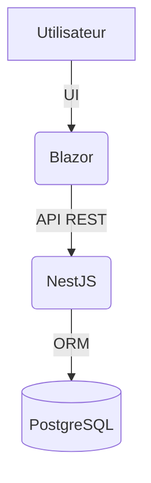

# Ysync

## Présentation
Ysync est une application web permettant la gestion de réservations de salles et de matériels. Elle propose une interface moderne (Blazor) côté Frontend et une API performante (NestJS) côté Backend.

---

## Architecture du projet

- **Frontend** : Application Blazor (C#)
  - Interface utilisateur moderne et réactive
  - Pages principales : Accueil, Réservations, Gestion des salles, Gestion des matériels
- **Backend** : API NestJS (TypeScript)
  - Gestion des utilisateurs, salles, matériels, réservations
  - Sécurité (authentification, autorisations)
  - Base de données via Prisma ORM

---

## Technologies utilisées

- **Frontend** :
  - Blazor (C#)
  - Bootstrap (UI)
- **Backend** :
  - NestJS (TypeScript)
  - Prisma ORM
  - PostgreSQL (ou autre SGBD compatible Prisma)
  - JWT (authentification)

---

## Fonctionnalités principales

- Authentification sécurisée (JWT)
- Gestion des utilisateurs
- Réservation de salles et de matériels
- Visualisation des disponibilités
- Notifications par mail (optionnel)

---

## Lancer le projet

### Prérequis
- Node.js, pnpm (ou npm), .NET 8+, PostgreSQL

### Backend
```bash
cd Backend/ysync
pnpm install
pnpm prisma migrate deploy # ou 'prisma db push' pour dev
pnpm start:dev
```

### Frontend
```bash
cd Frontend/BlazorApp
dotnet run
```

---

## Schéma d’architecture



---

## Auteurs

- [Ton Nom]

---

## Licence

MIT
